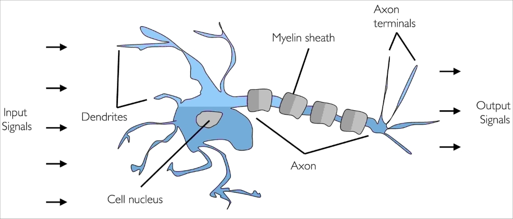
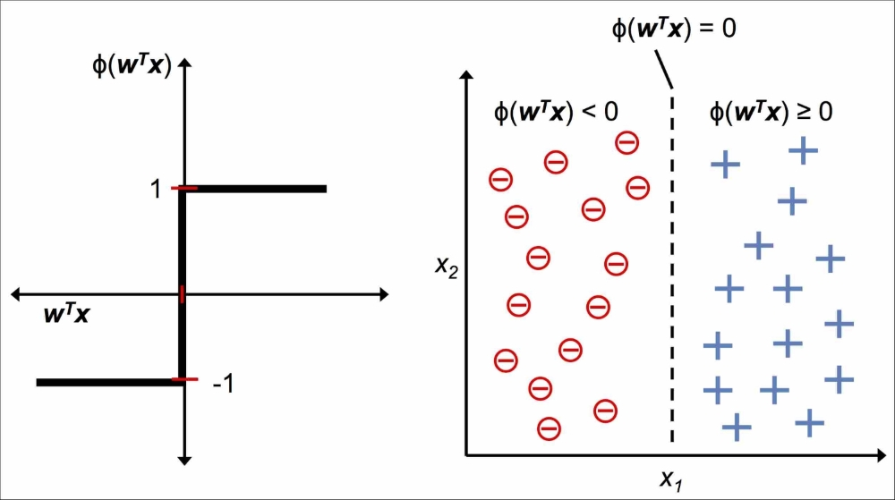
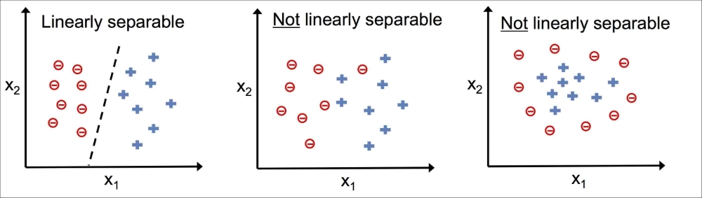
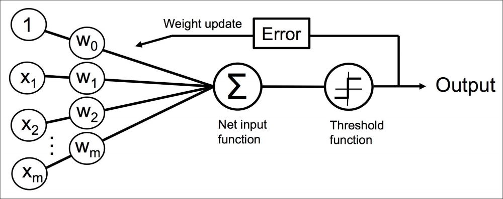

#%% md
# Description of methodology
# Classification algorithms
# Perceptron
From [Python Machine Learning - Second Edition By Sebastian Raschka, Vahid Mirjalili](https://www.packtpub.com/big-data-and-business-intelligence/python-machine-learning-second-edition)

Trying to understand how the biological brain works, in order to design AI, Warren McCulloch and Walter Pitts published the first concept of a simplified brain cell, the so-called McCulloch-Pitts (MCP) neuron, in 1943 ([A Logical Calculus of the Ideas Immanent in Nervous Activity, W. S. McCulloch and W. Pitts](https://www.cs.cmu.edu/~./epxing/Class/10715/reading/McCulloch.and.Pitts.pdf), Bulletin of Mathematical Biophysics, 5(4): 115-133, 1943). Neurons are interconnected nerve cells in the brain that are involved in the processing and transmitting of chemical and electrical signals, which is illustrated in the following figure:

McCulloch and Pitts described such a nerve cell as a simple logic gate with binary outputs; multiple signals arrive at the dendrites, are then integrated into the cell body, and, if the accumulated signal exceeds a certain threshold, an output signal is generated that will be passed on by the axon.

Only a few years later, Frank Rosenblatt published the first concept of the perceptron learning rule based on the MCP neuron model ([The Perceptron: A Perceiving and Recognizing Automaton](https://blogs.umass.edu/brain-wars/files/2016/03/rosenblatt-1957.pdf), F. Rosenblatt, Cornell Aeronautical Laboratory, 1957). With his perceptron rule, Rosenblatt proposed an algorithm that would automatically learn the optimal weight coefficients that are then multiplied with the input features in order to make the decision of whether a neuron fires or not. In the context of supervised learning and classification, such an algorithm could then be used to predict if a sample belongs to one class or the other.
#%% md
## The formal definition of an artificial neuron
More formally, we can put the idea behind artificial neurons into the context of a binary classification task where we refer to our two classes as 1 (positive class) and -1 (negative class) for simplicity. We can then define a decision function ($\phi(z)$) that takes a linear combination of certain input values $x$ and a corresponding weight vector $w$, where $z$ is the so-called net input:

$ \boldsymbol{w} = \begin{bmatrix} w_1 \\ \vdots \\ w_m \end{bmatrix}, \quad $ 
$ \boldsymbol{x} = \begin{bmatrix} x_1 \\ \vdots \\ x_m \end{bmatrix}, \quad $
$ z = w_1 x_1 + \dots + w_m x_m $

Now, if the net input of a particular sample $\boldsymbol{x}^{(i)}$ is greater than a defined threshold $\theta$, we predict class 1, and class -1 otherwise. In the perceptron algorithm, the decision function $\phi(\sign )$ is a variant of a unit step function:

$ \phi(z) =\begin{cases}1&{\text{if }}\ z \geq \theta,\\-1&{\text{otherwise}}\end{cases}$

For simplicity, we can bring the threshold $\theta$ to the left side of the equation and define a weight-zero as $w_0 = - \theta$ and $x_0 = 1$ so that we write $z$ in a more compact form:

$ z = w_0 x_0 + w_1 x_1 + \dots + w_m x_m = \sum_{j=0}^m \boldsymbol{x}_j \boldsymbol{w}_j = \boldsymbol{w}^T \boldsymbol{x} $

In machine learning literature, the negative threshold, or weight, $w_0 = - \theta$, is usually called the bias unit.

The following figure illustrates how the net input $ z = \boldsymbol{w}^T \boldsymbol{x} $ is squashed into a binary output (`-1` or `1`) by the decision function of the perceptron (left subfigure) and how it can be used to discriminate between two linearly separable classes (right subfigure):

#%% md
## The perceptron learning rule
The whole idea behind the MCP neuron and Rosenblatt's thresholded perceptron model is to use a reductionist approach to mimic how a single neuron in the brain works: it either fires or it doesn't. Thus, Rosenblatt's initial perceptron rule is fairly simple and can be summarized by the following steps:
1. Initialize the weights to 0 or small random numbers.
2. For each training sample:   
    a. Compute the output value.  
    b. Update the weights.

Here, the output value is the class label predicted by the unit step function that we defined earlier, and the simultaneous update of each weight $w_j$ in the weight vector $\boldsymbol{w}$ can be more formally written as:

$ w_j := w_j + \Delta w_j $

The value of $\Delta w_j$, which is used to update the weight $w_j$, is calculated by the perceptron learning rule:

$ \Delta w_j = \eta \left( y^{(i)} - \hat{y}^{(i)} \right) x_j^{(i)} $

Where $\eta$ is the **learning rate** (typically a constant between 0.0 and 1.0), $y^{(i)}$ is the **true class label** of the ith training sample, and $\hat{y}^{(i)}$ is the **predicted class label**. It is important to note that all weights in the weight vector are being updated simultaneously, which means that we don't recompute the $\hat{y}^{(i)}$ before all of the weights $\Delta w_j$ are updated. Concretely, for a two-dimensional dataset, we would write the update as:

$ \Delta w_0 = \eta \left( y^{(i)} - \text{output}^{(i)} \right) $  
$ \Delta w_1 = \eta \left( y^{(i)} - \text{output}^{(i)} \right) x_1^{(i)} $  
$ \Delta w_2 = \eta \left( y^{(i)} - \text{output}^{(i)} \right) x_2^{(i)} $

Let us make a simple thought experiment to illustrate how beautifully simple this learning rule really is. In the two scenarios where the perceptron predicts the class label correctly, the weights remain unchanged. However, in the case of a wrong prediction, the weights are being pushed towards the direction of the positive or negative target class.

To get a better intuition for the multiplicative factor $x_j^{(i)}$, let us go through another simple example, where:

$ y^{(i)}~ = +1,~ \hat{y}_j^{(i)}~ = -1,~ \eta = 1 $

Let's assume that $x_j^{(i)} = 0.5$, and we mis-classify this sample as `-1`. In this case, we would increase the corresponding weight by 1 so that the net input $x_j^{(i)} \times w_j^{(i)}$ would be more positive the next time we encounter this sample, and thus be more likely to be above the threshold of the unit step function to classify the sample as `+1`:

$ \Delta w_j^{(i)} = \left( 1 - (-1) \right)0.5 = \left( 2 \right) 0.5 = 1 $

The weight update is proportional to the value of $x_j^{(i)}$. For example, if we have another sample $x_j^{(i)} = 2$ that is incorrectly classified as -1, we'd push the decision boundary by an even larger extent to classify this sample correctly the next time:

$ \Delta w_j^{(i)} = \left( 1 - (-1) \right)2 = \left( 2 \right) 2 = 4 $

It is important to note that the convergence of the perceptron is only guaranteed if the two classes are linearly separable and the learning rate is sufficiently small. If the two classes can't be separated by a linear decision boundary, we can set a maximum number of passes over the training dataset (epochs) and/or a threshold for the number of tolerated mis-classifications—the perceptron would never stop updating the weights otherwise:

This simple diagram illustrates the general concept of the perceptron:

The preceding diagram illustrates how the perceptron receives the inputs of a sample $\boldsymbol{x}$ and combines them with the weights $\boldsymbol{w}$ to compute the net input. The net input is then passed on to the threshold function, which generates a binary output `-1` or `+1`—the predicted class label of the sample. During the learning phase, this output is used to calculate the error of the prediction and update the weights.